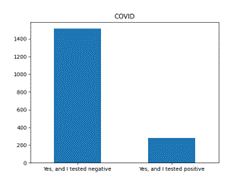
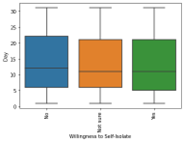
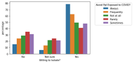

# COVID risk evaluation
### Canadian individual COVID risk evaluation model with self-isolation probability prediction
### Executive Summary
The Public Health Agency of Canada analyzed COVID-19 behaviour data collected by the Insitute of Global Health Innovation Imperial College London. The purpose was to identify a subset of questions from the data to be made available to Canadians through an online questionnaire which would inform Canadians whether they are suspected COVID positive/negative (refered as “Model 1”) and to determine, internally, whether they are willing to self-isolate (refered as “Model 2”). This will help Canadians who lack access to COVID-19 tests to identify their risk level and will help the Public Health Agency of Canada educate unwilling self-isolators through developing educational advertissment camapigns on good COVID-19 behaviour and the importance of self-isolating. The K-Nearest Neighbours (KNN) model was used on the identified subset of questions to assess whether these predictions were possible.
The overall Model 1 accuracy and precision for predicting whether an individual is COVID positive is 85% and 68%, respectively, however, the recall for predicting truly COVID positive cases is 7% which is rather low. Usage of solely Model 1 for identifying whether an individual is COVID positive or not is not advised.
The overall Model 2 accuracy and precision (optimized for the highest precision on a training set by K=2 for predicting whether an individual is willing to self-isolate is 64% and 59%, respectively. However, the recall for predicting the people unwilling to self-isolate is around 31%, which suggests that the model is prone to the Type II errors. But, assuming that precision is more important in identifying the people unwilling to quarantine, the model could significantly assist the decision making of the Public Health Agency.
### Introduction
The Institute of Global Health Innovation Imperial College London has collected COVID-19 behaviour data which is being analyzed by The Public Health Angency of Canada. This dataset contains information that was collected between the end of March until the middle of August 2020 during individual interviews. Interviewees were asked a series of questions regarding their symptoms, testing, isolation, social distancing, and other COVID-19 related behaviours. The original dataset included interview data from 29 countries, however, for the purpose of this analysis a subset of collected data was used and only included interviews from Canada and the United States.
The purpose of the Public Health Agency of Canada’s analysis of this data is two-fold: predict whether an individual is COVID positive/negative (Model 1) and whether they are willing to self-isolate (Model 2). This will be achieved by identifying a subset of questions from the interview data collected and packaging these questions in an online questionnaire which will be made available to Canadians. The intent of the questionnaire is to inform individuals who do not have access to COVID tests whether they are suspected to be COVID positive/negative which will be shown to the individual after the questionnaire is completed. The prediction of whether an individual is willing to self-isolate based on their answers to the questionnaire will be used internally to develop advertissment campaigns to educate specific types of behaviour that can help inform Canadians why self-isolating is important and identify whether certain types of behavior are indicators of whether someone is unwilling to self-isolate.
This report will begin by explaining how the data was prepared for the analysis performed. Then exploratory data analysis will be presented, justifying how certain model predictors were selected, followed by the performance of the K-Nearest Neighbours (KNN) model on the dataset. This will be shown for two models, one to predict whether an individual is COVID positive/negative and a second to predict whether the individual is willing to self-isolate.
### Data Cleaning
#### Raw Dataset Overview
The raw dataset has 79 columns and 28,825 rows. Before cleaning, we have six integer columns, one float column, and 72 categorical columns. Among the six integer columns, one of them is an index column that ranges from 0 to 28,824. Among the categorical columns, there is one data and time column which is not well structured, and two should be numerical columns that are categorical due to inaccuracy errors.
#### Handling Data Incompleteness Error
After inspection, we have discovered missing values in the following columns:

'i3_health', 'i4_health', 'i5_health_1', 'i5_health_2', 'i5_health_3', 'i5_health_4', 'i5_health_5', 'i5_health_99', 'i5a_health', 'i6_health', 'i7b_health', 'i8_health', 'i9_health', 'i10_health', 'i11_health', 'i12_health_9', 'i12_health_10', 'i14_health_1', 'i14_health_2', 'i14_health_3', 'i14_health_4', 'i14_health_5', 'i14_health_6', 'i14_health_7', 'i14_health_8', 'i14_health_9', 'i14_health_10', 'i14_health_96', 'i14_health_98', 'i14_health_99', 'i14_health_other' ,'d1_health_1', 'd1_health_2', 'd1_health_3', 'd1_health_4', 'd1_health_5', 'd1_health_6', 'd1_health_7', 'd1_health_8', 'd1_health_9', 'd1_health_10', 'd1_health_11', 'd1_health_12', 'd1_health_13', 'd1_health_98', 'd1_health_99'

The majority of the missing values are represented by a space string, the rest are represented by “__NA__”. After inspecting the data key, we realized that most of these missing data are not caused by data gathering error but how the questionnaire is structured. For instance, i6_health asks the extent of someone’s self-isolation if they have developed the symptoms described in the previous questions. If the answerer does not have any symptoms, this field will be left blank. Because of this, we believe that we should not simply remove these columns to prevent a loss of important information, instead, for most of the fields that are not applicable, we replaced them with “Not_Applicable”.
It is worth mentioning that during the missing data handling process we have decided to drop the i14_health_other column since its information is completely unstructured and there are 92.42% of data missing.
#### Handling Inaccuracy Error
We have noticed that two of the numerical columns, “household_size” and “household_children” were of type string. This was caused by the string values that were present in the data. Here are the unique values in these two columns before cleaning:

We replaced “8 or more” and “5 or more” with 8 and 5 respectively, and for the “Don’t know” and “Prefer not to say” values, we decided to use a multiple linear regression model to predict them, with other available variables as predictors. The regression yields a fairly well-adjusted r-square of 71.2%. After replacing them with the predicted result, we changed the column’s type to integer.
#### Further Feature Engineering
Two features were decomposed or modified to produce easier-to-use variables for later machine learning model training. 

Figure 2: Before Decomposition

Figure 3: After Decomposition

The first feature that was engineered is “endtime”, which was structured as “dd/mm/yyyy time” before decomposition. We decomposed this feature to create four new features: day, month, year and time. Year and time columns are eventually dropped due to all data coming from the same year and the time feature has zero correlation with all other fields.
The second modified feature was “RecordNo”. Before modification, the value of “RecordNo” was composed of two parts, country code + index, where the index is identical to the “Index” field which ranges from 0 to 28,824. By removing the index part of this feature, we have turned it into a structured categorical variable which can be further used in model training.
The below figure shows a summary of the data columns remaining after data cleaning and their data type.

### Utilizing KNN To Predict COVID Result
#### Exploratory Data Analysis
Correlation Matrix

The only multicollinearity problem highlighted by the correlation matrix was between variable “i1_health” and “i2_health” with a positive correlation of 0.5. This relationship can be explained by the fact that question “i1_health” asks the individual how many people they’ve come in contact with in their household, while “i2_health” asks how many people has the individual come in to contact with outside of their household. A positive correlation may be explained by the fact that a more socially active person usually spends time with family and friends more at the same time.
Multivariate and Distribution Analysis of Numerical Variables
From Figure 8 we can see that almost all numerical variables, except “Day” and “household_size”, are positively skewed, and it is evident that the skewness of “i1_health”, “i2_health”, “i7a_health”, “i3_health” and “weight” are caused by a few extreme outliers.

Crosstab analysis

We also conducted a cross tab analysis to several variables. Since the dataset is highly biased, we normalized the scale of the data in order to directly figure out the percentage of positive patients. We found that some variables can be grouped together thus we just randomly pick two of them in the same category to find the probable patterns. i5_health collects individual information such as COVID symptoms, like fever and cough. After conducting the crosstab analysis of these variables, we found that those who had these kinds of symptoms are more likely to be COVID positive.

Another variable that is highly correlated to the status of COVID is their family’s condition. From the crosstab analysis we can see that those who have positive families also tend to have covid, since condition 5 has the highest proportion of COVID positive patients.

For the employment_status, we can see that there is not much difference in the percentage of positive patients.
COVID Test Result vs Numerical Predictors
Box plots can show the distribution of numeric variables. If the median is much different between COVID positive and negative groups, we can conclude that this variable has some predictive power. In the box plots below, we can see that household size and household children have a big difference in their medians for the two conditions. Thus, these two variables will be included in into the model.

Data Imbalance in COVID results
As we can see from the chart below, the target variable is extremely imbalanced where the number of positives are about 5 times the number of negatives. However, this distribution in test result is expected as the majority of the population are not COVID positive. We will inspect further into the effect that this data imbalance might cause to our KNN model in later model training and result evaluation process. 

#### Model 1 Training
The dataset is randomly divided into a training dataset and a testing dataset with a partition ratio of 80 – 20. We have tried several models, and we mainly focused on the false negative rate of each model. We finally decided to include all the variables. The model has an accuracy of 83.84% and a false negative rate of 55.54%. This is probably because the data is biased, and we don’t have sufficient data to better predict the result.
Hyperparameter Tuning
We calculate the best K in the range of one to fifteen. The best K is 6 and its corresponding accuracy is 86.07%.

Confusion Matrix
In the result we find the precision is 16.36% and the false negative rate is 30.76%. The most important thing in the model is to correctly classify those who are positive to be positive, and that’s what the false negative rate tells us. 

### Predicting Willingness to Self-Isolate
The following section focuses on the exploratory data analysis and machine learning modelling related to predicting the willingness to self-isolate if that person were to develop symptoms in the next 7-days.
#### Exploratory Data Analysis 
Exploratory data analysis (EDA) was performed to identify whether certain questions collected during the Imperial College interviews were telling of the target variable, would an individual self-isolate (i.e., i9_health).
For continuous variables, box plots were generated to identify the columns’s range as well as to visually observe any peculiarties in the dataset. Figure 16  below shows the boxplots for variables that have unexpected data points, for example, i1_health, which represents the number of people that individual came into contact with in their household has a maximum value of 1,000. This value seems unlikely and will be considered when using this parameter in the model development step. The data points for weight are also unexpected as all individuals who were interviewed were above 20 years old and they all correspond to weight values that are less than 20 units. As the weight values were not well understood it was not included as a predictor.

Both categorical and continuous variables were plotted with the target variable to identify whether any patterns exist and whether they would be good predictors for the model. 
Boxplots were generated for continuous variables, whereas bar charts were generated for categorical variables. Examples of plots demonstrating potential relationships of the predictor variable and the target variable for both box and bar plots are shown below. Refer to Appendix A for additional figures for variables that were chosen to be included in the model in some form.
The box plots show that the day which the individual completed the questionnaire has no relationship to whether they are willing to self-isolate. However, the box plot for individuals who are willing to self-isolate has a higher median age (roughly 53 years old) whereas the box plot for individuals who are not willing to self-isolate has a lower median (roughly 40 years old). Therefore, this could be an indication that younger people are less likely willing to self-isolate. Therefore, age will be included as a predictor in the model whereas day of questionnaire completion will not. This sort of analysis was completed for other continuous variables which is displayed in Appendix A.

Bar plots were used to analyze categorical variables similarly, each bar represents a percentage and the percentages for each colour of bar sums to 100%. For example, roughly 18% of people who were experiencing a cough while taking this questionnaire responded that they were not willing to self isolate which is the same percentage of people who were not experiencing a cough. Therefore, whether an individual had a cough or not may not be a strong indicator of whether they are willing to self-isolate or not. Predictors that had different percentages of the predictor variable in the willingness to isolate and not willing to isolate indicates that this variable may be a useful predictor. For example, the percentage of people that always avoid people who have been exposed to COVID and are not willing to self-isolate is around 14% while the percentage of people who always avoid people who have been exposed to COVID and are willing to self-isolate is around 80%, therefore, this predictor may be useful in predicting whether an individual is willing to self-isolate or not. Refer to Appendix A for more EDA associated with categorical variables.

Based on the exploratory data analysis the following predictors will be included in the initial modelling step:

•	Number of people an individual has come in contact with in their household and outside

•	Whether the individual or someone in their household has done a COVID test in the past 7-days

•	COVID symptoms of the individual, their COVID behaviour and pre-existing health conditions (a new column was created to aggregate the related columns for each category to lower the number of predictors the model)

•	How many times an individual has left their residence yesterday

•	How difficult it is for someone to self-isolate

•	How many times they’ve washed their hands yesterday

•	Age, gender, and employment status

•	Number of people and children in their house hold, and;

•	Latitude and longitude of the individuals residence 

•	We have come up with new compound features, in order to optimize the number of predictors: i5_health_avg, i12_health_avg, d1_health_avg, i10_11_sum, i10_11_prod.

Variables that reported outliers will be engineered to either remove outliers or will be transformed to mitigate the influence of outliers on the model. Additionally, questions related to symptoms, pre-existing health conditions and COVID-19 behaviour were aggreagted for each category of questions which is explained further in the next section of the report.
K-Nearest Neighbors Model for Predicting Willingness to Self-Isolate
The predictors mentioned above were used as predictors in the K-Nearest Neighbors (KNN) model. Prior to running the model some additional data cleaning and feature engineering was performed to get the predictor columns in a suitable format for the KNN model in the scikit-learn Python library.
First, all categorical variables were converted to numerical variables by developing a hot-encoding function. Missing values of the response variable which were previously labeled as “N/A” were given their own category as to not lose the value of the unanswered question.
Second, topics such as an individual’s COVID symptoms, COVID behaviour and their pre-existing health issues were aggegated into a single column by taking the arithmetic average of the hot-encoded values. This was done to decrease the number of predictors used in the KNN model.
Third, the individual’s region of residence was converted to a latitude and logitude in order to convert the wide range of region options into continuous variables. This was performed because it is believed that the individual’s location is important in identifying whether someone is willing to self isolate or not, as certain provinces or state may have different perspectives on “acceptable ” COVID behaviour.
Fourth, outliers from continuous variable predictors were mitigated by eliminating data points which were more than five standard deviations away from the mean of that column. Additionally, continuous variable parameters with outliers were log transformed to minimize the effect of outliers.
Finally, the data was split into training and testing data using a 75% training and 25% testing data set. Once the data was split it was standardized to ensure that all predictor variables are of similar ranges as the KNN algorithm can be impacted more severely by predictor variables that have a higher range of values. 
### Model 2 Training
After the feature engineering and data splitting part was completed, we have realized that the number of people willing to self-isolate is significantly higher than those unwilling. Therefore, our dataset was highly biased. In order to rebalance it, we could have added duplicated rows from the unwilling class or tried to randomly remove the datapoints from the willing class. Nevertheless, after many tests, we had discovered that it is very efficient to assume that all the “Not sure” and "N/A” values in the dataset stem from the fact that people tried to avoid self-isolation without openly acknowledging it. This is why we trained the model on the data where all “Not sure” and “N/A” values were converted to “No” (i.e., not willing to self-isolate) to obtain almost perfectly balanced dataset. Whereas, for the testing stage we have only used the datapoints which were explicitly labeled as either “Yes” or “No”, in order to distance the impact of the initial assumption on the model’s performance.
Hyperparameter Tuning 
K-fold cross-validation was performed in order to determine the optimal number of neighbors for our model. Since we were mostly interested in identifying people unwilling to self-isolate, we chose “precision” as the optimization (see Figure 19). The cross-validation with 5 folds suggested that K=2 is the optimal parameter for our KNN model. Interestingly enough, the even values of K yielded much better precision scores than their odd “neighbors”. As it was tested for large Ks, the precision scores went down and flattened out.

Confusion Matrix
As expected, there is a trade-off between precision and recall. Since we assumed that precision is more important in the business application, we optimized our parameter of K=2, which yielded the accuracy of 64%, precision of 59% and recall of 31% (see Figure 20). 

If we were to select another value of the parameter K, the precision would be at most 50%, but on the other hand, recall would grow over 50%. The Figure 21 shows the overall summary report for the Model 2 run on the testing data at K=2.

### Conclusion
The Public Health Agency of Canada has analyzed data collected from individual interviews regarding COVID-19. A subset of these questions were selected to be part of an online questionnaire in an attempt to help Canadians identify whether they are likely COVID positive or negative and to help the Canadian government identify areas for educational improvement to promote self-isolating if you have contracted COVID. This was achieved by using the answers from individual interviews as predictors for the above two topics using a K-Nearest Neighbours classification algorithm. The overall model accruacy and precision for predicting whether an individual is COVID positive is 85% and 68%, respectively, however, the recall for predicting truly COVID positive cases is 7% which is rather low. Usage of solely this model for identifying whether an individual is COVID positive or not is not advised and at the minimum a disclaimer should be provided to the individual to seek a COVID test. The overall model accuracy and precision for predicting whether an individual is willing to self-isolate is 64% and 59%, respectively, with a recall of 31%. We highly recommend that these two models are used together to achieve better results: once a person is predicted to have COVID-19, it should be estimated whether they would self-isolate or further spread the disease.

### Appendix
The figure below shows boxplots for continuous variables in order to identify any outliers or abnormalities in the dataset. 

The boxplots below are shown for household size and number of children in the household. The interquartile range (IQR) is wider for individuals who indicated that they are not willing to self-isolate compared to those that indicated they are willing to self-isolate (IQR of 2-4 vs. IQR of 2-3 for household size and IQR of 0-2 vs. IQR of 0-1 for number of children). Therefore, these variables may have some predictive power in identifying whether an individual is willing to self-isolate or not.

